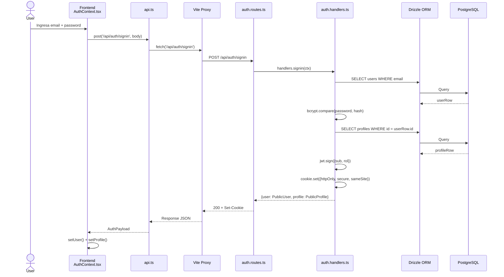
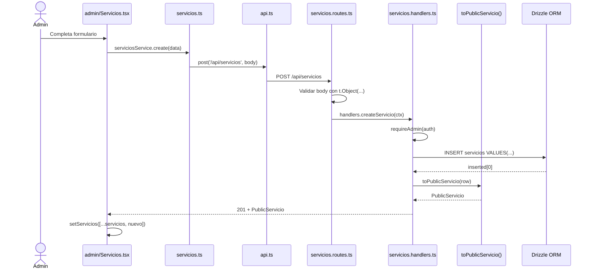
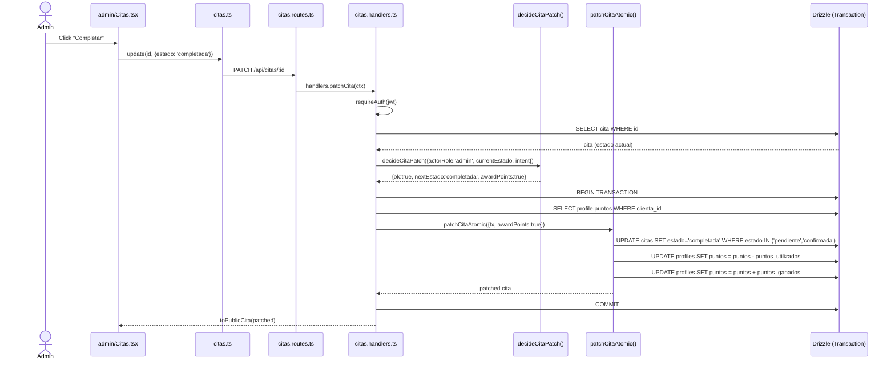
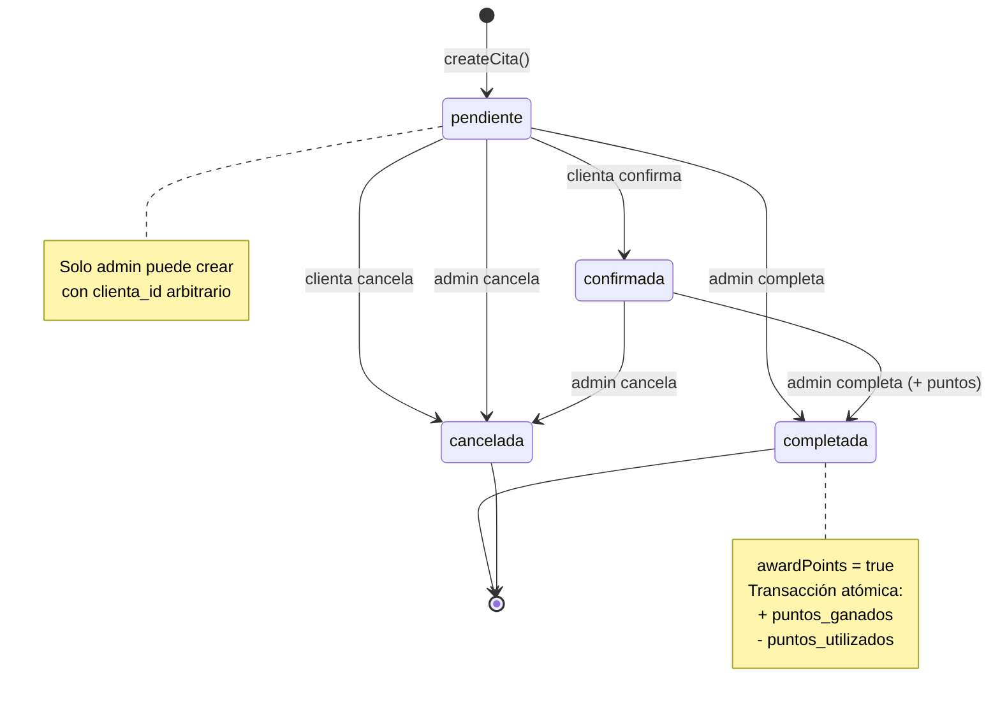

# Arquitectura — fidelity-card

Sistema de gestión de fidelity card para centro de belleza. Monorepo Bun con 3 workspaces: frontend (React + Vite), backend (Elysia + Drizzle) y shared (tipos TypeScript).

---

## Estructura del Proyecto

```
fidelity-card/                          # Root workspace (Bun workspaces)
├── frontend/                           # @fidelity-card/frontend
│   ├── src/
│   │   ├── components/                 # UI reutilizable
│   │   │   ├── Button.tsx              # Botón con variantes
│   │   │   ├── Card.tsx                # Card, CardHeader, CardTitle, CardContent
│   │   │   ├── Input.tsx               # Input controlado con label
│   │   │   ├── Select.tsx              # Select controlado con label
│   │   │   ├── LoadingSpinner.tsx       # Spinner — existe pero NO se usa
│   │   │   ├── Navbar.tsx              # Navegación principal
│   │   │   ├── RequireAuth.tsx         # Guard: requiere sesión activa
│   │   │   └── RequireAdmin.tsx        # Guard: requiere rol admin
│   │   ├── contexts/
│   │   │   ├── AuthContext.tsx          # Provider + hook useAuth (L1-138)
│   │   │   └── authTypes.ts            # AuthUser, AuthPayload
│   │   ├── pages/                       # Vistas de clienta
│   │   │   ├── Home.tsx                # Landing page
│   │   │   ├── Login.tsx               # Formulario de login
│   │   │   ├── Register.tsx            # Formulario de registro
│   │   │   ├── Servicios.tsx           # Catálogo de servicios
│   │   │   ├── Premios.tsx             # Catálogo de premios
│   │   │   ├── Referidos.tsx           # Mis referidos
│   │   │   ├── MisCitas.tsx            # Citas de la clienta
│   │   │   └── admin/                  # Vistas de administración
│   │   │       ├── Dashboard.tsx       # Panel principal admin
│   │   │       ├── Citas.tsx           # Gestión de citas (~200 líneas boilerplate)
│   │   │       ├── NuevaCita.tsx       # Crear cita
│   │   │       ├── EditarCita.tsx      # Editar cita existente
│   │   │       ├── CitaForm.tsx        # Formulario compartido crear/editar
│   │   │       ├── Servicios.tsx       # CRUD servicios (~377 líneas)
│   │   │       ├── Clientas.tsx        # Gestión de clientas
│   │   │       └── Premios.tsx         # CRUD premios
│   │   ├── services/                   # Cliente HTTP al backend
│   │   │   ├── api.ts                  # Fetch wrapper: ApiError, timeout 15s, JSON (L1-118)
│   │   │   ├── auth.ts                 # signup, signin, signout, me
│   │   │   ├── citas.ts               # CRUD citas + CitaItemInput local (L4-7)
│   │   │   ├── servicios.ts            # CRUD servicios + getById N+1 (L9-11)
│   │   │   ├── premios.ts              # CRUD premios + getById N+1 (L9-11)
│   │   │   ├── profiles.ts             # GET/PATCH profiles
│   │   │   ├── referidos.ts            # GET/POST referidos + getById N+1 (L9-11)
│   │   │   └── puntos.ts              # ⚠ Lógica de negocio en frontend (L20-46)
│   │   ├── utils/
│   │   │   └── index.ts               # cn(), formatearFecha/Hora/Precio, esFechaPasada
│   │   ├── App.tsx                     # Router principal + LayoutWithNav
│   │   └── main.tsx                    # Entry point React
│   ├── public/                         # Activos estáticos
│   ├── index.html                      # Entry point Vite
│   ├── vite.config.ts                  # Proxy /api -> localhost:3001
│   └── package.json                    # React 19, Tailwind v4, React Router v7
│
├── backend/                            # @fidelity-card/backend
│   ├── src/
│   │   ├── db/                         # Capa de datos (Drizzle ORM)
│   │   │   ├── index.ts                # Pool + instancia Drizzle (L1-20)
│   │   │   └── schema/                 # Definiciones de tablas
│   │   │       ├── index.ts            # Re-exports de todos los schemas
│   │   │       ├── enums.ts            # Enums compartidos
│   │   │       ├── users.ts            # Tabla users (email, password_hash)
│   │   │       ├── profiles.ts         # Tabla profiles (nombre, rol, puntos)
│   │   │       ├── servicios.ts        # Tabla servicios (nombre, precio, puntos)
│   │   │       ├── citas.ts            # Tabla citas (estado, puntos_ganados)
│   │   │       ├── cita_servicios.ts   # Tabla pivot cita↔servicio
│   │   │       ├── referidos.ts        # Tabla referidos (puntos_ganados)
│   │   │       ├── premios.ts          # Tabla premios (puntos_requeridos)
│   │   │       └── recordatorios.ts    # Tabla recordatorios (no usada aún)
│   │   ├── domain/                     # Lógica de negocio pura
│   │   │   ├── logic/                  # Funciones puras sin efectos
│   │   │   │   ├── citas.ts            # decideCitaPatch() — máquina de estados (L28-102)
│   │   │   │   ├── citas.items.ts      # validateCitaItems(), computeCitaTotals() (L1-63)
│   │   │   │   └── citas.patch-atomic.ts # patchCitaAtomic() — transacción atómica (L31-65)
│   │   │   ├── transformers/           # toPublic*() — filas DB → shapes API
│   │   │   │   ├── iso.ts              # asIsoString() — normaliza fechas
│   │   │   │   ├── auth.ts             # toPublicUser()
│   │   │   │   ├── profiles.ts         # toPublicProfile()
│   │   │   │   ├── servicios.ts        # toPublicServicio()
│   │   │   │   ├── citas.ts            # toPublicCita(row, items?)
│   │   │   │   └── referidos.ts        # toPublicReferido()
│   │   │   └── types/                  # Tipos públicos del backend
│   │   │       ├── auth.ts             # Rol, SignupBody, SigninBody, PublicUser, PublicProfile
│   │   │       ├── citas.ts            # CitaEstado, CitaItem, PublicCita
│   │   │       ├── servicios.ts        # PublicServicio
│   │   │       ├── referidos.ts        # PublicReferido
│   │   │       └── http.ts             # StatusHelper
│   │   ├── modules/                    # Capa HTTP (routes + handlers)
│   │   │   ├── auth-context.ts         # JWT middleware + guards (L1-97)
│   │   │   ├── auth.handlers.ts        # signup/signin/signout/me
│   │   │   ├── auth.routes.ts          # POST /api/auth/*
│   │   │   ├── servicios.handlers.ts   # CRUD servicios
│   │   │   ├── servicios.routes.ts     # GET/POST/PATCH/DELETE /api/servicios
│   │   │   ├── citas.handlers.ts       # CRUD + lógica de citas (L1-518)
│   │   │   ├── citas.routes.ts         # Rutas de citas con validación
│   │   │   ├── profiles.handlers.ts    # GET/PATCH profiles
│   │   │   ├── profiles.routes.ts      # Rutas de profiles
│   │   │   ├── premios.handlers.ts     # CRUD premios (SIN transformer)
│   │   │   ├── premios.routes.ts       # Rutas de premios
│   │   │   ├── referidos.handlers.ts   # Referidos + puntos top/sumar/restar
│   │   │   └── referidos.ts            # Rutas de referidos + puntos
│   │   └── index.ts                    # Ensamblaje de la app Elysia (L1-81)
│   ├── drizzle/                        # Migraciones SQL generadas
│   ├── scripts/                        # Seeds (admin, servicios, clientas, premios)
│   └── drizzle.config.ts               # Configuración Drizzle Kit
│
├── packages/shared/                    # @fidelity-card/shared
│   └── src/types/
│       ├── auth.ts                     # Rol = 'admin' | 'clienta' (L1)
│       └── entities.ts                 # Profile, Servicio, Cita, CitaItem, Referido, Premio (L1-66)
│
├── e2e/                                # Tests E2E (Playwright)
├── docker-compose.yml                  # Postgres local para dev
├── package.json                        # Root workspace config
└── ARCHITECTURE.md                     # Este archivo
```

---

## Arquitectura por Capas

```mermaid
block-beta
    block:frontend["Frontend (React 19 + Vite)"]
        UI["UI Layer\npages/ + components/"]
        State["State Layer\nAuthContext"]
        Service["Service Layer\nservices/*.ts"]
        Transport["Transport Layer\napi.ts (fetch)"]
    end

    block:proxy["Vite Dev Proxy"]
        VP["/api/* → localhost:3001"]
    end

    block:backend["Backend (Elysia + Bun)"]
        Routes["Transport Layer\n*.routes.ts"]
        Handlers["Handler Layer\n*.handlers.ts"]
        Domain["Domain Layer\nlogic/ + transformers/"]
        Data["Data Layer\ndb/schema/"]
    end

    block:storage["Persistencia"]
        PG["PostgreSQL"]
    end

    UI --> State
    State --> Service
    Service --> Transport
    Transport --> VP
    VP --> Routes
    Routes --> Handlers
    Handlers --> Domain
    Handlers --> Data
    Data --> PG

    block:shared["Shared Types\n@fidelity-card/shared"]
    end
    Service -.->|"usa tipos"| shared
    Domain -.->"⚠ NO usa" shared
```

### Capas del Frontend

| Capa | Archivos | Responsabilidad |
|------|----------|----------------|
| UI | `pages/`, `components/` | Renderizado React, manejo de formularios |
| State | `contexts/AuthContext.tsx` | Sesión global del usuario |
| Service | `services/*.ts` | Abstracción de llamadas HTTP |
| Transport | `services/api.ts` | Fetch wrapper con timeout, error parsing, cookies |

### Capas del Backend

| Capa | Archivos | Responsabilidad |
|------|----------|----------------|
| Transport | `modules/*.routes.ts` | Registro de rutas + validación con Elysia `t` |
| Handler | `modules/*.handlers.ts` | Bridge HTTP ↔ Dominio (auth checks, DB queries, responses) |
| Domain | `domain/logic/`, `domain/transformers/` | Lógica pura: decisiones, validaciones, mapeos |
| Data | `db/schema/`, `db/index.ts` | Drizzle ORM: definiciones de tablas + pool de conexiones |

---

## Grafo de Dependencias

```mermaid
graph TD
    subgraph "Frontend Services"
        api["api.ts<br/>fetch wrapper"]
        citasSvc["citas.ts"]
        serviciosSvc["servicios.ts"]
        premiosSvc["premios.ts"]
        profilesSvc["profiles.ts"]
        referidosSvc["referidos.ts"]
        puntosSvc["puntos.ts ⚠"]
        authSvc["auth.ts"]
    end

    subgraph "Frontend UI"
        AuthCtx["AuthContext.tsx"]
        AdminPages["admin/*.tsx"]
        ClientPages["pages/*.tsx"]
    end

    subgraph "Backend Modules"
        authCtx["auth-context.ts<br/>JWT + guards"]
        authH["auth.handlers.ts"]
        citasH["citas.handlers.ts"]
        serviciosH["servicios.handlers.ts"]
        premiosH["premios.handlers.ts"]
        profilesH["profiles.handlers.ts"]
        referidosH["referidos.handlers.ts"]
    end

    subgraph "Backend Domain"
        decideCita["citas.ts<br/>decideCitaPatch()"]
        citaItems["citas.items.ts<br/>validate + compute"]
        patchAtomic["citas.patch-atomic.ts"]
        transformers["transformers/*.ts<br/>toPublic*()"]
        domainTypes["domain/types/*.ts"]
    end

    subgraph "Backend Data"
        db["db/index.ts<br/>Pool + Drizzle"]
        schemas["db/schema/*.ts"]
    end

    subgraph "Shared"
        sharedTypes["shared/types/*.ts"]
    end

    %% Frontend deps
    citasSvc --> api
    serviciosSvc --> api
    premiosSvc --> api
    profilesSvc --> api
    referidosSvc --> api
    puntosSvc --> api
    puntosSvc -->|"⚠ N+1 calls"| serviciosSvc
    authSvc --> api
    AuthCtx --> api
    AdminPages --> citasSvc & serviciosSvc & premiosSvc & profilesSvc & referidosSvc & puntosSvc
    ClientPages --> authSvc & citasSvc & serviciosSvc

    %% Frontend → Shared
    citasSvc -.->|"usa tipos"| sharedTypes
    serviciosSvc -.->|"usa tipos"| sharedTypes
    premiosSvc -.->|"usa tipos"| sharedTypes
    profilesSvc -.->|"usa tipos"| sharedTypes
    referidosSvc -.->|"usa tipos"| sharedTypes
    puntosSvc -.->|"usa tipos"| sharedTypes

    %% Backend deps
    citasH --> decideCita & citaItems & patchAtomic & transformers & authCtx & db
    serviciosH --> transformers & authCtx & db
    premiosH -->|"⚠ SIN transformer"| authCtx & db
    profilesH --> transformers & authCtx & db
    referidosH --> transformers & authCtx & db
    authH --> transformers & db

    %% Backend Domain → types
    decideCita --> domainTypes
    citaItems --> domainTypes
    patchAtomic --> domainTypes
    transformers --> domainTypes

    %% Data
    citasH & serviciosH & premiosH & profilesH & referidosH & authH --> schemas

    %% Backend does NOT use shared
    domainTypes -.->|"⚠ NO importa"| sharedTypes
```



---

## Flujos de Datos

### Autenticación (Signup / Signin)



### CRUD Genérico (ej: Crear Servicio)



### Completar Cita (Flujo Más Complejo)



### Máquina de Estados de Cita



---

## Patrones de Diseño

| Patrón | Dónde | Propósito |
|--------|-------|-----------|
| Service Layer | `frontend/src/services/*.ts` | Abstrae llamadas HTTP del UI |
| Repository Pattern | `backend/src/db/schema/` | Drizzle ORM abstrae SQL |
| Transformer/DTO | `backend/src/domain/transformers/*.ts` | Separa filas DB de respuestas API |
| Dependency Injection | `backend/src/modules/*.handlers.ts` | Handlers reciben `db` como dependencia |
| Factory Pattern | `create*Handlers(deps)` | Crea handlers con dependencias inyectadas |
| Context Provider | `frontend/src/contexts/AuthContext.tsx` | Estado global de autenticación |
| Pure Functions | `backend/src/domain/logic/` | Lógica de negocio sin efectos secundarios |
| Guard Pattern | `requireAuth` / `requireAdmin` | Protege rutas por rol |
| Atomic Operations | `patchCitaAtomic()` | Transacciones DB para operaciones críticas |
| Decision Pattern | `decideCitaPatch()` | Separa lógica de decisión de ejecución |

---

## Dependencias Externas

### Frontend

| Paquete | Versión | Propósito | Dónde se usa |
|---------|---------|-----------|--------------|
| react | 19 | UI framework | Todo el frontend |
| react-router | v7 | Routing SPA | `App.tsx`, páginas |
| tailwindcss | v4 | Estilos utilitarios | Todos los componentes |
| react-hook-form | 7.71 | Manejo de formularios | Admin forms |
| lucide-react | — | Iconos SVG | Components, pages |

### Backend

| Paquete | Propósito | Dónde se usa |
|---------|-----------|--------------|
| elysia | HTTP framework | `index.ts`, routes |
| @elysiajs/jwt | JWT handling | `auth-context.ts` |
| drizzle-orm | ORM type-safe | `db/`, handlers |
| pg | Driver PostgreSQL | `db/index.ts` |
| bcryptjs | Hash de passwords | `auth.routes.ts`, `auth.handlers.ts` |

### Shared

| Paquete | Propósito |
|---------|-----------|
| (ninguno) | Solo tipos TypeScript — zero runtime deps |

---

## Contrato API

### Autenticación

| Método | Path | Auth | Descripción |
|--------|------|------|-------------|
| `POST` | `/api/auth/signup` | Público | Registro de nueva clienta |
| `POST` | `/api/auth/signin` | Público | Login → JWT en cookie httpOnly |
| `POST` | `/api/auth/signout` | Público | Elimina cookie de sesión |
| `GET` | `/api/auth/me` | Cookie JWT | Retorna usuario + profile actual |

### Servicios

| Método | Path | Auth | Descripción |
|--------|------|------|-------------|
| `GET` | `/api/servicios` | Público | Lista todos los servicios |
| `POST` | `/api/servicios` | Admin | Crea un servicio nuevo |
| `PATCH` | `/api/servicios/:id` | Admin | Actualiza campos parciales |
| `DELETE` | `/api/servicios/:id` | Admin | Elimina un servicio |

### Citas

| Método | Path | Auth | Descripción |
|--------|------|------|-------------|
| `GET` | `/api/citas` | Auth | Lista citas (admin: todas, clienta: propias) |
| `GET` | `/api/citas/proximas` | Admin | Citas con fecha ≥ hoy |
| `GET` | `/api/citas/pendientes` | Admin | Citas en estado pendiente/confirmada |
| `GET` | `/api/citas/:id` | Auth | Detalle de cita con items |
| `POST` | `/api/citas` | Auth | Crea cita (admin elige clienta_id) |
| `PUT` | `/api/citas/:id` | Admin | Reemplaza items + fecha de cita |
| `PATCH` | `/api/citas/:id` | Auth | Cambia estado/notas (reglas por rol) |
| `DELETE` | `/api/citas/:id` | Auth | Elimina cita (admin o dueña) |

### Profiles

| Método | Path | Auth | Descripción |
|--------|------|------|-------------|
| `GET` | `/api/profiles` | Admin | Lista profiles (filtro por rol) |
| `GET` | `/api/profiles/:id` | Auth | Detalle de profile (propio o admin) |
| `PATCH` | `/api/profiles/:id` | Auth | Actualiza datos del profile |

### Premios

| Método | Path | Auth | Descripción |
|--------|------|------|-------------|
| `GET` | `/api/premios` | Público | Lista todos los premios |
| `POST` | `/api/premios` | Admin | Crea un premio nuevo |
| `PATCH` | `/api/premios/:id` | Admin | Actualiza campos parciales |
| `DELETE` | `/api/premios/:id` | Admin | Elimina un premio |

### Referidos

| Método | Path | Auth | Descripción |
|--------|------|------|-------------|
| `GET` | `/api/referidos` | Auth | Lista referidos (admin: todos, filtro por referente_id) |
| `POST` | `/api/referidos` | Admin | Crea referido + suma puntos al referente |

### Puntos

| Método | Path | Auth | Descripción |
|--------|------|------|-------------|
| `GET` | `/api/puntos/top` | Auth | Top clientas por puntos (limit configurable) |
| `POST` | `/api/puntos/sumar` | Admin | Suma puntos a un profile |
| `POST` | `/api/puntos/restar` | Admin | Resta puntos (min 0) a un profile |

### Health

| Método | Path | Auth | Descripción |
|--------|------|------|-------------|
| `GET` | `/api/health` | Público | Health check |
| `GET` | `/api/_admin` | Admin | Verifica acceso admin |

---

## Oportunidades de Refactor

### #1: `getById` con patrón N+1

**Where**: `frontend/src/services/servicios.ts:9-11`, `frontend/src/services/premios.ts:9-12`, `frontend/src/services/referidos.ts:9-12`

**Problem**: Tres servicios implementan `getById()` trayendo TODOS los registros y filtrando client-side. No existen endpoints `GET /api/:resource/:id` para servicios, premios ni referidos. `puntos.ts:23-28` lo empeora haciendo un N+1 dentro de `calcularPuntosCita()`.

**Fix**: Agregar endpoints individuales en el backend (o reutilizar los que ya existen como `GET /api/citas/:id` como referencia), actualizar los servicios del frontend para usarlos directamente.

### #2: Lógica de negocio en el frontend (`puntos.ts`)

**Where**: `frontend/src/services/puntos.ts:20-46`

**Problem**: Contiene `calcularPuntosCita()` (N+1 API calls por servicio), `otorgarPuntosCita()` (verifica estado), y `otorgarPuntosReferido()`. El backend ya maneja el otorgamiento de puntos atómicamente en `patchCitaAtomic()` (`backend/src/domain/logic/citas.patch-atomic.ts:31-65`). El frontend nunca debería calcular ni otorgar puntos — es una fuente de inconsistencias.

**Fix**: Eliminar `calcularPuntosCita()` y `otorgarPuntosCita()` del frontend. Mantener solo `sumarPuntos`, `restarPuntos`, `getTopClientas` como wrappers de la API.

### #3: Tipo `Rol` definido 3 veces

**Where**: `packages/shared/src/types/auth.ts:1`, `backend/src/domain/types/auth.ts:1`, `backend/src/modules/auth-context.ts:4`

**Problem**: Agregar un nuevo rol requiere actualizar 3 archivos independientes. Ya pasó: los tres dicen `'admin' | 'clienta'` pero nada los sincroniza.

**Fix**: Importar `Rol` desde `@fidelity-card/shared` en el backend. Puede requerir ajustar `tsconfig` del backend para resolver el workspace.

### #4: Módulo Premios no usa transformers

**Where**: `backend/src/modules/premios.handlers.ts:54,79,106`

**Problem**: `listPremios` retorna filas crudas de DB (`deps.db.select().from(premios)`), y `createPremio`/`patchPremio` retornan `row` directamente. Todos los demás módulos usan `toPublic*()`. Esto filtra internals de la DB al API consumer.

**Fix**: Crear `backend/src/domain/transformers/premios.ts` con `toPublicPremio()`. Actualizar los 3 handlers para usarlo.

### #5: Boilerplate duplicado en admin pages

**Where**: `frontend/src/pages/admin/Citas.tsx`, `Servicios.tsx`, `Clientas.tsx`, `Premios.tsx`

**Problem**: Cada página repite ~200 líneas de patrón idéntico: `useState` para lista/loading/search/modal/formData, `useEffect` para carga inicial, handlers CRUD casi idénticos. `Servicios.tsx` tiene 377 líneas donde la mayoría es boilerplate.

**Fix**: Extraer hook `useAdminCrud<T>(service, transformFn)` que maneje loading, search, modal state y operaciones CRUD. Alternativamente, un componente genérico `AdminPage<T>` con slots para el formulario.

### #6: `LoadingSpinner` sin usar

**Where**: `frontend/src/components/LoadingSpinner.tsx` existe pero se ignora.

**Problem**: Múltiples páginas duplican JSX de spinner inline (`<svg ...animate-spin.../>`). Inconsistencia visual y mantenimiento innecesario.

**Fix**: Reemplazar todos los spinners inline con `<LoadingSpinner />`. Buscar con `grep -r "animate-spin" frontend/src/` para encontrar todos los casos.

### #7: Patrón de auth guard con doble casting

**Where**: Todos los handlers (`citas.handlers.ts:100,135,151,166,235,269,361,484`, `servicios.handlers.ts:64,91,120`, `premios.handlers.ts:59,84,111`, `profiles.handlers.ts:58,77,98`, `referidos.handlers.ts:64,90,154,171,194`)

**Problem**: Cada handler repite `const jwt = ((auth as unknown) ?? null) as AuthJwtPayload | null; const denied = requireAdmin(...)`. Es un code smell que genera ruido visual y propenso a errores.

**Fix**: Crear helper `useAuthFromCtx(ctx)` que retorne `{ jwt, denied }` tipado, o usar el patrón `derive` de Elysia para inyectar `auth` ya tipado en el contexto.

### #8: Backend no usa el paquete shared

**Where**: `backend/src/domain/types/` define tipos `Public*` independientes en vez de importar de `@fidelity-card/shared`

**Problem**: Riesgo de drift silencioso: backend y frontend pueden definir tipos divergentes para la misma entidad. `PublicProfile` en `backend/src/domain/types/auth.ts:22-31` y `Profile` en `packages/shared/src/types/entities.ts:3-12` son casi idénticos pero viven separados.

**Fix**: Alinear backend para importar desde `@fidelity-card/shared` o generar tipos desde un solo origen. Requiere ajustar configuración de paths del backend.

### #9: `CitaItemInput` triplicado

**Where**: `frontend/src/services/citas.ts:4-7`, `backend/src/domain/logic/citas.items.ts:1-4`, `packages/shared/src/types/entities.ts:25-28`

**Problem**: Tres versiones del mismo tipo `{ servicio_id: string; tipo: 'comprado' | 'canjeado' }`. Cambiar la estructura requiere editar 3 archivos.

**Fix**: Usar `CitaItem` de `@fidelity-card/shared` en frontend y backend. Eliminar las definiciones locales.

---

## Matriz de Prioridad

| # | Oportunidad | Impacto | Esfuerzo | Prioridad |
|---|-------------|---------|----------|-----------|
| 1 | `getById` N+1 | Alto | Bajo | 🔴 Hacer primero |
| 2 | Lógica de negocio en frontend | Alto | Medio | 🔴 Hacer primero |
| 3 | `Rol` triplicado | Medio | Bajo | 🟡 Hacer después |
| 4 | Premios sin transformer | Medio | Bajo | 🟡 Hacer después |
| 5 | Boilerplate admin pages | Medio | Medio | 🟡 Hacer después |
| 6 | `LoadingSpinner` sin usar | Bajo | Trivial | 🟢 Planificar |
| 7 | Auth guard casting | Medio | Medio | 🟢 Planificar |
| 8 | Backend no usa shared | Medio | Alto | 🔵 Diferir |
| 9 | `CitaItemInput` triplicado | Bajo | Bajo | 🟢 Planificar |
